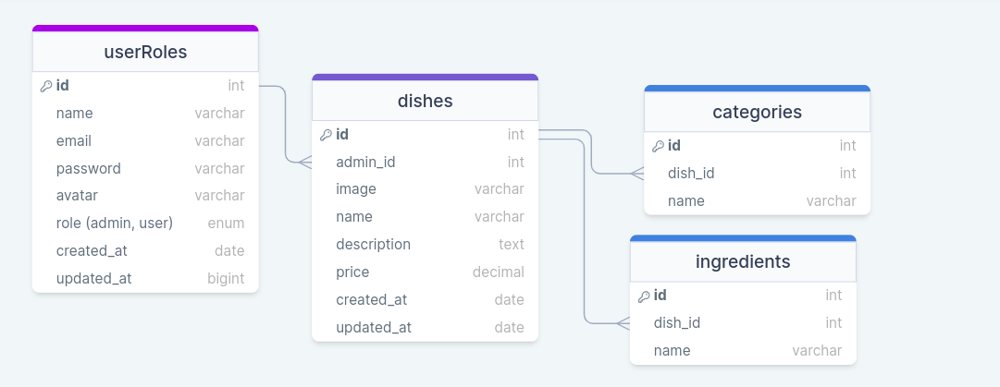

# FOODEXPLORER-API

Esta é uma API gerenciamento de restaurantes  desenvolvida para proporcionar uma plataforma versátil que permite aos usuários, especialmente restaurantes e estabelecimentos de gastronomia, administrar o catálogo de pratos oferecidos, o usuário poderá vizualizar pratos, pesquisar por pratos ou ingredientes, salvar pratos favoritos, acompanhar histórico de pedidos, já o admin  poderá criar, visualizar, editar e apagar um prato a qualquer momento. A API foi construída usando Node.js e utiliza o framework Express.js para lidar com as rotas e requisições HTTP. O banco de dados utilizado é o SQLite, e o Knex.js é utilizado como um query builder para interagir com o banco de dados.

## Tecnologias Utilizadas

As principais tecnologias utilizadas no desenvolvimento desta API são:

- Node.js: ambiente de execução JavaScript do lado do servidor.
- Express.js: framework web para construção de APIs e aplicativos web.
- SQLite: banco de dados relacional utilizado para armazenar as informações da API.
- Knex.js: query builder utilizado para interagir com o banco de dados SQLite.
- bcryptjs: biblioteca para a criptografia de senhas.
- cors: Cross-Origin Resource Sharing, um mecanismo para permitir acesso controlado a recursos de um servidor de um domínio diferente na web.

## Endpoints

A API possui os seguintes endpoints:

### Usuários

- **POST /users**: Cria um novo usuário na base de dados. Requer os campos "name", "email" e "password" no corpo da requisição.

- **POST /sessions**: Responsável por logar o usuário na aplicação gerando um token para o mesmo usar futuramente nas suas requisições. Requer os campos "email" e "password" no corpo da requisição.

### Pratos

- **POST /dishes**: Cria um  novo prato. Requer os campos  "name", "description", "ingredients", "categories", "price",  no corpo da requisição. O campo "image" deve ser enviado do via FormData.

- **PUT /dishes/:dish_id**: Atualiza dos dados de um prato existente. Requer o campo "dish_id" como um parâmetro de rota.

- **GET /dishes?search=**: Lista todos os pratos cadastrados. Aceita os parâmetros opcionais "search" e o nome do prato ou ingrediente que deseja buscar. Caso o parâmetro "search" seja fornecido, a API irá filtrar os pratos correspondentes aos ingredientes e virse versa.

- **GET /dishes/id**: Retorna informações detalhadas sobre um prato específico. Requer o campo "id" como um parâmetro de rota..

- **DELETE /dishes/:id**: Exclui um prato específico. Requer o campo "id" como um parâmetro de rota.

### Favoritos

- **POST /favorites**: Adiciona o prato espefífico a tabela de favoritos. Requer o campo "user_id" que é inserido no cabeçalho das requisições, e campo  "dish_id" inserido no corpo da requisição.

- **GET /favorites**: Lista todos os pratos favoritos relacionados a um usuário específico. Requer o campo "user_id" que é inserido no cabeçalho das requisições.
 
- **DELETE /favorites/:id**: Remove o prato específico da tabela de favoritos. Requer o campo "id" do praro específo como parâmetro.

## Configuração do Projeto

1. Clone este repositório em sua máquina local.
2. Certifique-se de ter o Node.js e o NPM (Node Package Manager) instalados em seu sistema.
3. Execute o comando `npm install` na pasta raiz do projeto para instalar todas as dependências.
4. Execute o comando `npm start` para iniciar o servidor da API.
5. A API estará disponível em `http://localhost:3333`.

## Banco de Dados

A API utiliza o banco de dados SQLite para armazenar as informações. As migrações do banco de dados estão configuradas para criar as tabelas necessárias automaticamente. As tabelas criadas são:

- Tabela "userRoles": Armazena informações dos usuários, como nome, e-mail, senha e role, seja ela "admin" ou "user".
- Tabela "dishes": Armazena dados dos pratos do restaurante, incluindo nome, descrição, endereço da imagem, preço e o ID do admin.
- Tabela "categories": Armazena as categorias dos pratos, com nome da categoria, e o ID do prato correspondente.
- Tabela "ingredients": Armazena os ingredientes dos pratos, com nome do ingrediente, e o ID do prato correspondente.

## Contribuição

Contribuições são bem-vindas! Se você encontrar algum problema, tiver sugestões de melhorias ou quiser adicionar novos recursos, sinta-se à

## Autor

Este projeto foi desenvolvido por Adão Carvalho. Aqui estão algumas informações sobre o autor:

- **Nome**: Adão Carvalho
- **Descrição**: Sou um desenvolvedor de software apaixonado por tecnologia e programação. Tenho experiência no desenvolvimento de aplicações web e estou sempre buscando aprender novas tecnologias. Este projeto foi criado como parte do meu aprendizado e prática de desenvolvimento de APIs.
- **Contato**: Você pode entrar em contato comigo pelo e-mail carvalhohuzumak@gmail.com.
- **Perfil**: Você pode encontrar mais projetos e trabalhos no meu perfil do GitHub: [acpcarvalhoh](https://github.com/acpcarvalhoh)

Sinta-se à vontade para entrar em contato comigo para mais informações sobre o projeto ou para qualquer outra questão relacionada.

